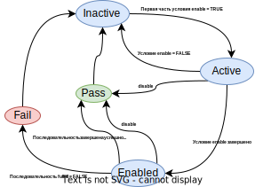
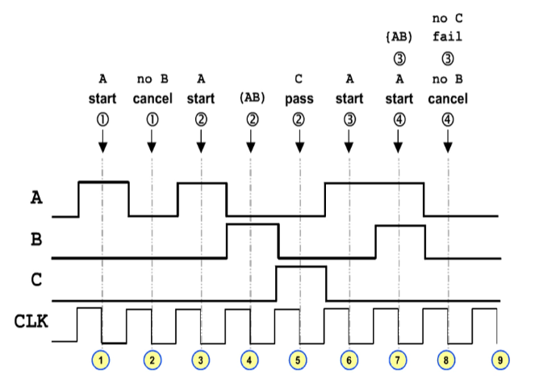
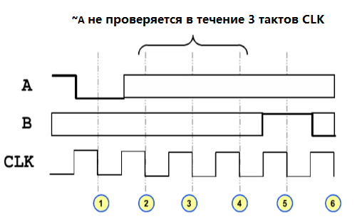
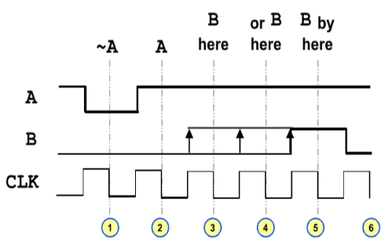

# Лабораторная работа "SystemVerilog: Assertions"

Прежде чем начать изучать способы верификации с использованием инструментов языка SystemVerilog, необходимо изучить существующие и появившиеся типы данных.

## Цель

---
## Ход работы

## Теория
**Утверждения** (**Assertions**) - это средство проверки некоторого свойства модели. Примером такого свойства может служить следующее: регистр состояния конечного автомата может принимать только значения, определенные в перечислении. Если во время прохождения  тестов, предназначенных для выявления другого типа ошибок это свойство окажется нарушенным, то утверждение сообщит об ошибке. Другой пример - работа системной шины, у которой определены протоколы чтения и записи. При тестировании моделируется исполнение процессором некоторой программы: для выборки команд и работы с данными производится доступ к памяти, при этом утверждения проверяют отсутствие нарушений протоколов шины. 

Существует два типа утверждений: непосредственные (immediate) и параллельные (concurrent).

- *Непосредственное утверждение* - процедурный оператор и потому может встречаться в любом месте кода, где допустимы процедурные операторы. Обычно непосредственное утверждение является частью тестового окружения и находится в блоке initial. Его функция - проверять заданное условие и сообщить о возникновении ошибки. Если ошибки не обнаружено, исполнение продолжается со следующего оператора.
- *Параллельное утверждение* - отдельный (параллельный) процесс, целью которого является проверка заданного свойства. Будучи один раз запущен, он так и продолжает работать.

### Кто занимается разработкой утверждений и зачем?
| Кто  | Тип утверждений | Зачем | Пример | 
| ------------- | ------------- | ------------- | ------------- |
|Архитектор|Абстрактные свойства|Соответствие реализации функциональным требованиям|Асинхронный FIFO не может быть заполнен и пуст одновременно|
|Разработчик RTL|Функциональные свойства|Соответствие реализации свойствами, которые заложены разработчиком|Когда Read и Write нахоятся в нуле, FIFO пусто|
|Верификатор|Функциональное покрытие|Проверка краевых ситуаций|Чтение из заполненного FIFO, запись в пустое FIFO, и т. д.|
|Разработчик IP-блоков|Корректное использлвание IP|Указать пользователю IP-блока неправильное его использование|FIFO прочитано в пустом состоянии|

## Непосредественные утверждения
Непосредственные утверждения реализуются внутри процедурного блока и активны внутри этого же блока. Их поведение напоминает конструкцию if-else. Иначе говоря, приведенное ниже утверждение

```verilog
always @(negedge clk) begin
  assert !(wr_en && rd_en);
end
```
эквивалентно выражению
```verilog
always @(negedge clk) begin
  if(wr_en && rd_en) begin
    $display("error!");
  end
end
```
Утверждение сообщит об ошибке, в случае если выражение примет значения `0,Z,X`. 
Недостатки непосредственных утверждений заключаются в том, что они требуют дополнительного кода вокруг утверждения для сложных выражений, а также для утверждений, которые проверяют последовательности событий во времени. При написании таких утверждений возникают побочные проблемы отладки, так как их сложность может стать сравнимой со сложностью разрабатываемого устройства. Как правило, такие утверждения бывают плохо читаемы, поскольку могут разрабатываться до разработки RTL.

## Параллельные утверждения
Параллельные утверждения - независимо исполняемый процесс, проверяющий, что некоторое свойство модели выполняется в течение всего времени симуляции. Сначала определяется свойство, а затем активируется его проверка. Утверждение, следуя принципам моделирования на уровне регистровых передач, синхронизируется тактовым сигналом. Проверка осуществляется симулятором на этапе наблюдения с использованием значений, сэмплированных на этапе предварительной обработки.

Параллельное утверждение имеет вид:
```verilog
label: assert property (pname) pass_statement else fail_statement;
```
`assert, property, else` - ключевые слова языка;
`label` - метка оператора (необязательный аргумент);
`pname` - имя свойства;
`pass_statement` - оператор, исполняемый, когда свойство выполняется (необязательный аргумент);
`fail_statement` - оператор, исполняемый, когда свойство нарушается.

Рассмотрим простое свойство `q1r3s`. По переднему фронту тактового сигнала `ck` проверяется, что значение переменной `q` равно единице, спустя один такт - что значение `r` равно единице, а спустя ещё три такта - что значение `s` равно единице.
```verilog
module simpleAssert;
  bit q;
  bit r; 
  bit s;
  bit ck;
  ...
  property q1r3s;
    @(posedge ck) q ##1 r ##3 s;
  endproperty

  assert property (q1r3s) else $error("Error found!");
endmodule
```

В вышеуказанном свойстве используются переменные, объявленные в модуле. Свойства могут быть параметризованы. В утверждениях может осуществляться подстановка фактических параметров.

```verilog
property a1b3c(a,b,c);
  @(posedge ck) a ##1 b ##3 c;
endproperty

assert property (a1b3c(q,r,s)) else $error("Error found!")
```

Рассмотрим ещё одну сущность, используемую в утверждениях - **последовательности**. Это важные свойства спецификации поведения, которые можно определять отдельно от свойств. Это делается при помощи ключевого слова `sequence`. В рассматриваемом примере последовательность можно описать следующим образом:
```verilog
sequence abxxc(a,b,c);
  a ##1 b ##3 c;
endaequence
```

```verilog
property checkQRS(q,r,s);
  @(posedge ck) abxxc(q,r,s);
endproperty
```

Следует учесть, что последовательность `abxxc` является частью поведения. Например, если бы переменная `d` должна была принимать единицу через два такта после `abxxc`, свойство можно записать так:
```verilog
property checkQRSD(q,r,s);
  @(posedge ck) abxxc(q,r,s) ##2 d;
endproperty
```
### Статусы утверждений
Работа утверждений напоминает работу конечного автомата, граф состояний которого можно изобразить следующим образом:


```verilog
@(clocking) disable iff (dis_expr) enable |=> fulfill;
```
Все изменения происходят по списку чувствительности **clocking**. Изначально утверждение находится в неактивном состоянии (**inactive**). Разрешающая последовательность enable может быть составной. Как только первая часть последовательности *enable* становится истинной, утверждение переходит в активный статус (**active**). Как только последовательность *enable* становится истинной, утверждение переходит в статус **enabled**. В случае, если задано условие *disabled*, утверждение переходит в статус **Pass**. Если последовательность *fulfill* завершается успешно, утверждение переходит в статус успешно завершенного (**Pass**), в противном случае - в статус неуспешно завершённого (**Fail**). Затем утверждение возвращается в неактивный статус (**inactive**).

--- 
Рассмотрим более подробно последовательности и то, как их составлять. Многие утверждения пишутся с использованием оператора импликации: поток утверждения запускается, только если определённое условие истино. Так можно избежать состояния бессодержательного успеха. Импликация может иметь две формы:
- **`i |-> j`** - если выражение `i` истинно сейчас, то выражение `j` должно быть истинно сейчас;
- **`i |=> j`** - если выражение `i` истинно сейчас, то выражение `j` должно быть истинно на следующем такте. 

 Свойства могут быть **условными** и **безусловными**. Безусловные свойства используют булевы выражения. Например:
  ```verilog
    property UNCOND;
      @(posedge CLK) (COUNT > 10);
    endproperty
  ```

Условные свойства используют оператор импликации. 
```verilog
  property COND;
    @(posedge CLK) A |=> C ## D;
  endproperty
```
В данном примере последовательность A называется разрешающей (enabling sequence), а последовательность D - исполняющей (fulfilling sequence). На практике следует избегать безусловных свойств, поскольку проверка таких свойств выполняется на каждом шаге симуляции.

Нередко встречаются ситуации, когда проще указать нежелательное поведение. Для таких случаев используется ключевое слово **not**.  Например, значение COUNT никогда не должно быть больше 10. 
```verilog
  property NEVER_BOOL;
  @(posedge CLK) not (COUNT > 10);
  endproperty
```

Разберём подробно примеры некоторых свойств:
```verilog
  property SQA;
    @(negedge CLK) (A ##1 B) |=> C;
  endproperty
```


1. А принимает значение 1. Проверяется разрешающая последовательность (A ##1 B);
2. B не устанавливается в 1. Проверка свойства завершается;
3. А снова устанавливается в 1. Аналогично, проверяется B через один такт;
4. B принимает значение 1. Разрешающая последовательность выполнена;
5. С принимает значение 1. Свойство выполнено.
6. аналогично шагу 3
7. аналогично шагу 4
8. C принимает значение 0, поэтому свойство не выполнено и завершается со статусом Fail.

---
Оператор `##` может использовать целочисленный аргумент для обозначения числа тактов, через которое предполагается наступление события, стоящего в правой части оператора.
```verilog
  expr1 ##N expr2
```
```verilog
  property S4;
    @(negedge CLK)
      ~A |=> ##3 B;
  endproperty
```


TODO: Описать функции \$rose(expr), \$fell(expr).

---

#### Отключение свойства
На практике обычно возникают случаи, когда заданное свойство не должно наступать при определенном условии. Например, если устройство находится в режиме сброса, те или иные поведенческие свойства выполняться не должны. В таких случаях утверждение можно отключить с помощью оператора `disable iff`.

```verilog
  property NAME;
    @(clocking) disable iff (expr)
    property;
  endproperty
```
Если выражение `expr` принимает истинное значение, то утверждение будет принимать статус **pass**.

--- 

Оператор `##` предоставляет широкую функциональность использования, которая рассматривается ниже.

#### Возникновение события через заданное число тактов
```verilog
  expr1 #[min:max] expr2
```
После возникновения `expr1`, `expr2` должно принять истинное значение спустя min тактов, но не более max.
```verilog
  property S4;
    @(negedge CLK)
      ~A |=> A ##[1:3] B;
  endproperty
```
Механизм проверки отражён на рисунке ниже:


---
#### Последовательное повторение
```
  SEQ_A[*N]
```
Данная конструкция указывает, что последовательность SEQ_A повторяется N раз.
TODO: figure 24:22

```
  SEQ_A[*min:max]
```
Данная конструкция указывает, что последовательность SEQ_A повторяется от min до max раз.
TODO: figure 26:14, описать оператор $

---
#### Непоследовательное повторение
```
  expr1 [=N]
```
Данная конструкция указывает, что последовательность expr1 должна выполниться N раз, не обязательно последовательно.
TODO: 33:00

```
  expr1 [->N]
```
Данная конструкция указывает на то, что expr1 должно возникнуть в N-ом цикле последовательности
TODO: 33:54

```
  A ##1 B[=1:2] ##1 C
```
TODO: описать поведение данной конструкции

---
Пример: 37:04


### Композиции последовательностей
Выше были рассмотрены свойства, включающие в себя одну последовательность, однако функциональность языка SystemVerilog позволяет разрабатывать свойства с композицией последовательностей.


### Расширенные возможности

---
## Список используемой литературы
Ниже приведены материалы, используемые при разработке курса. Они же являются рекомендуемыми к изучению. Условные свойства - свойства, испрользующие оператор импликации. 
- **Дональд Томас** - **Логическое проектирование и верификация систем на SystemVerilog**
- **SystemVerilog Assertions 4.2** (курс Cadence)
- **SVA, Formal and JasperGold Fundamentals for Designers v1906** (курс Cadence)
- **IEEE 1800-2017**